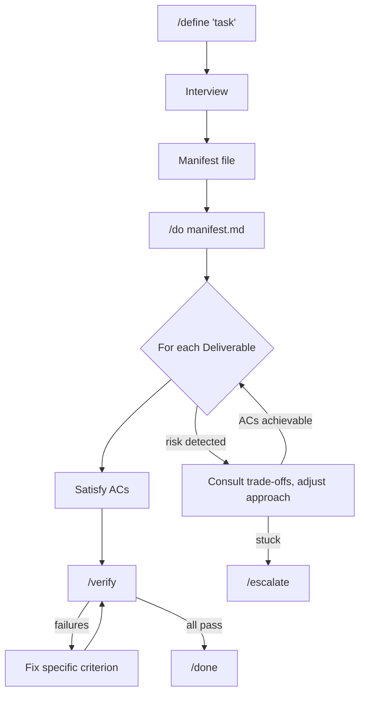

<p align="center">
  <picture>
    
  </picture>
</p>

# Manifest-Driven Development

Stop iterating with the model after implementation. Define what you'd accept, run two commands, ship it.

## Quick Start

```bash
# Install (run inside Claude Code)
/plugin marketplace add doodledood/manifest-dev
/plugin install manifest-dev@manifest-dev-marketplace

# Use
/define <what you want to build>
/do <manifest-path>
```

Two commands. `/define` interviews you and builds a manifest. `/do` executes it. That's the whole workflow.

## The Mindset Shift

Instead of telling the AI *how* to build something, you tell it what you'd accept.

Say you need a login page. The old way: "use React Hook Form, validate with Zod, show inline errors, disable the button while submitting." You've made every design decision upfront. The manifest way: "invalid credentials show an error without clearing the password field" and "the form can't be submitted twice." You define the bar. The AI picks how to clear it. Automated verification confirms it did.

## How It Works



`/define` interviews you to surface what you actually want. The stuff you'd reject in a PR but wouldn't think to specify upfront. Then `/do` implements toward those acceptance criteria, flexible on *how* but not on *what*.

After each deliverable, `/verify` runs automated checks against every criterion. Failing checks say exactly what's wrong. The AI fixes what failed, only what failed, and the loop continues until everything passes or a blocker needs your attention.

## What Changes

Your first pass lands closer to done. Issues get caught by verification before you see them, and the fix loop handles cleanup without your involvement. Every acceptance criterion has been verified, and you know what was checked.

While one manifest executes, you can define the next. The define phase is where your judgment matters; the do-verify-fix phase runs on its own. Writing acceptance criteria also forces you to stay engaged with your own code, which matters when heavy AI usage starts making your codebase feel foreign.

Resist the urge to intervene during `/do`. It won't nail everything on the first pass. That's expected. You invested in define; let the loop run.

## Who This Is For

If you've burned out on the weekly "game-changing AI coding tool" cycle and just want something that works, this is for you. Experienced developers who care more about output quality than execution speed. People who've learned the hard way that AI-generated code needs guardrails more than cheerleading.

We build around how LLMs actually work, not how we wish they worked. That means investing upfront for better results, not optimizing for token cost or raw speed. If you're counting every cent per token or want the fastest possible output regardless of quality, this probably isn't your thing.

---

Everything below is reference. You don't need any of it to get started.

---

## Going Deeper

<details>
<summary><strong>The problem this solves</strong></summary>

You plan a feature with the agent. It implements. The code looks reasonable. Then you review it and half the things aren't how you'd want them: wrong error handling patterns, conventions ignored, edge cases skipped. You send it back. It fixes some things, breaks others. Two or three rounds later you're satisfied, but you've spent more time reviewing and iterating than you saved.

The models can code. But we're throwing them into deep water without defining what "done" actually means. So the review-iterate loop eats the productivity gains.

Manifest-dev front-loads that review energy into `/define`. You spell out acceptance criteria and invariants before implementation starts. The do phase becomes mechanical, and the output lands closer to what you'd accept as a reviewer.

</details>

<details>
<summary><strong>Why this works (LLM first principles)</strong></summary>

LLMs are goal-oriented pattern matchers trained through reinforcement learning, not general reasoners. Clear acceptance criteria play to that strength. Rigid step-by-step plans fall apart because neither you nor the model can predict every detail upfront. Acceptance criteria focus on outcomes and leave implementation open.

There's also the drift problem. Long sessions cause the model to lose track of earlier instructions. The manifest compensates with external state and verification that catches drift before it ships. And since LLMs can't express genuine uncertainty (they'll confidently produce broken code), the verify-fix loop doesn't rely on the AI knowing it failed. It relies on automated checks catching failures.

These are design constraints, and the workflow treats them that way.

</details>

<details>
<summary><strong>Process Guidance and Approach</strong></summary>

The manifest also supports Process Guidance and an initial Approach (architecture, execution order). These are exactly what they sound like: recommendations, not requirements. Hints to help the model make better decisions while it's still not AGI. The acceptance criteria are the contract; the guidance is optimization on top.

This is spec-driven development adapted for LLM execution. The manifest is a spec, but ephemeral: it drives one task, then the code is the source of truth. No spec maintenance. No drift.

</details>

**Pro tip**: Run `/do` in a fresh session after `/define` completes, or at minimum, `/compact` before starting. The manifest is your external state; the session doesn't need to remember the conversation.

## What /define Produces

The interview classifies your task (Code, Writing, Document, Blog, Research) and loads task-specific guidance. It probes for your latent criteria, the standards you hold but wouldn't think to spell out. A `manifest-verifier` agent validates the manifest for gaps before output.

<details>
<summary><strong>Example manifest</strong></summary>

````markdown
# Definition: User Authentication

## 1. Intent & Context
- **Goal:** Add password-based authentication to existing Express app
  with JWT sessions. Users can register, log in, and log out.
- **Mental Model:** Auth is a cross-cutting concern. Security invariants
  apply globally; endpoint behavior is per-deliverable.

## 2. Approach
- **Architecture:** Middleware-based auth with JWT stored in httpOnly cookies
- **Execution Order:** D1 (Model) → D2 (Endpoints) → D3 (Protected Routes)
- **Risk Areas:**
  - [R-1] Session fixation if tokens not rotated | Detect: security review
  - [R-2] Timing attacks on password comparison | Detect: constant-time check
- **Trade-offs:**
  - [T-1] Simplicity vs Security → Prefer security (use bcrypt, not md5)

## 3. Global Invariants (The Constitution)
- [INV-G1] Passwords never stored in plaintext
  ```yaml
  verify:
    method: bash
    command: "! grep -r 'password.*=' src/ | grep -v hash | grep -v test"
  ```
- [INV-G2] All auth endpoints rate-limited (max 5 attempts/minute)
  ```yaml
  verify:
    method: subagent
    agent: general-purpose
    prompt: "Verify rate limiting exists on /login and /register endpoints"
  ```
- [INV-G3] JWT secrets from environment, never hardcoded
  ```yaml
  verify:
    method: bash
    command: "grep -r 'process.env.JWT' src/auth/"
  ```

## 4. Process Guidance (Non-Verifiable)
- [PG-1] Follow existing error handling patterns in the codebase
- [PG-2] Use established logging conventions

## 5. Known Assumptions
- [ASM-1] Express.js already configured | Default: true | Impact if wrong: Add setup step
- [ASM-2] PostgreSQL available | Default: true | Impact if wrong: Adjust migration

## 6. Deliverables (The Work)

### Deliverable 1: User Model & Migration
**Acceptance Criteria:**
- [AC-1.1] User model has id, email, hashedPassword, createdAt
  ```yaml
  verify:
    method: codebase
    pattern: "User.*id.*email.*hashedPassword.*createdAt"
  ```
- [AC-1.2] Email has unique constraint
- [AC-1.3] Migration creates users table with indexes

### Deliverable 2: Auth Endpoints
**Acceptance Criteria:**
- [AC-2.1] POST /register creates user, returns 201
- [AC-2.2] POST /login validates credentials, returns JWT
- [AC-2.3] Invalid credentials return 401, not 500
  ```yaml
  verify:
    method: subagent
    agent: code-bugs-reviewer
    prompt: "Check auth routes return 401 for auth failures, not 500"
  ```
````

</details>

## The Manifest Schema

| Section | Purpose | ID Scheme |
|---------|---------|-----------|
| **Intent & Context** | Goal and mental model | -- |
| **Approach** | Architecture, execution order, risks, trade-offs | `R-{N}`, `T-{N}` |
| **Global Invariants** | Task-level rules (task fails if violated) | `INV-G{N}` |
| **Process Guidance** | Non-verifiable recommendations for how to work | `PG-{N}` |
| **Known Assumptions** | Low-impact items with defaults | `ASM-{N}` |
| **Deliverables** | Ordered work items with acceptance criteria | `AC-{D}.{N}` |

Approach section is added for complex tasks with dependencies, risks, or architectural decisions.

## Verification Methods

Every criterion can have an automated verification method:

| Method | When to Use | Example |
|--------|-------------|---------|
| `bash` | Commands with deterministic output | `npm run typecheck && npm run lint` |
| `codebase` | Code pattern checks | Check file exists, pattern matches |
| `subagent` | LLM-as-judge for subjective criteria | Code quality, security review |
| `research` | External information lookup | API compatibility, version checks |
| `manual` | Human verification required | UI review, deployment checks |

```yaml
# Bash verification
verify:
  method: bash
  command: "npm run test -- --coverage"

# Subagent verification with specialized reviewer
verify:
  method: subagent
  agent: code-maintainability-reviewer
  prompt: "Review for DRY violations and coupling issues"

# Manual verification
verify:
  method: manual
  instructions: "Verify the login flow works in staging"
```

## Plugin Architecture

### Core Skills

| Skill | Type | Description |
|-------|------|-------------|
| `/define` | User-invoked | Interviews you, classifies task type, probes for latent criteria, outputs manifest with verification methods |
| `/do` | User-invoked | Executes against manifest. Follows execution order, watches for risks, logs progress for disaster recovery |
| `/verify` | Internal | Spawns parallel verifiers for all criteria. Routes to `criteria-checker` agents based on verification method |
| `/done` | Internal | Prints hierarchical completion summary mirroring manifest structure |
| `/escalate` | Internal | Structured escalation when blockers need human intervention. Requires evidence: 3+ attempts, failure reasons, hypothesis, resolution options |

### Review Agents

Built-in agents for quality verification via `subagent` method:

| Agent | Focus |
|-------|-------|
| `criteria-checker` | Core verifier: validates single criterion using bash/codebase/subagent/research methods |
| `manifest-verifier` | Validates manifest completeness during `/define` |
| `code-bugs-reviewer` | Race conditions, data loss, edge cases, logic errors, resource leaks |
| `code-maintainability-reviewer` | DRY violations, coupling, cohesion, dead code, consistency |
| `code-design-reviewer` | Design fitness: reinvented wheels, code vs configuration boundary, under-engineering, interface foresight, PR coherence |
| `code-simplicity-reviewer` | Over-engineering, premature optimization, cognitive complexity |
| `code-testability-reviewer` | Excessive mocking requirements, logic buried in IO, hidden dependencies |
| `code-coverage-reviewer` | Test coverage gaps in changed code |
| `type-safety-reviewer` | TypeScript type safety: `any` abuse, invalid states representable, narrowing issues |
| `docs-reviewer` | Documentation accuracy against code changes |
| `claude-md-adherence-reviewer` | Compliance with CLAUDE.md project rules |

Each reviewer returns structured output with severity levels (Critical, High, Medium, Low) and specific fix guidance.

### Workflow Enforcement Hooks

Hooks enforce workflow integrity. The AI can't skip steps:

| Hook | Event | Purpose |
|------|-------|---------|
| `stop_do_hook` | Stop command | Blocks premature stopping. Can't stop without verification passing or proper escalation. |
| `post_compact_hook` | Session compaction | Restores /do workflow context after compaction. Reminds to re-read manifest and log. |
| `pretool_verify_hook` | `/verify` invocation | Ensures manifest and log are in context before spawning verifiers. |

### Task-Specific Guidance

`/define` loads guidance based on task classification:

| Task Type | Guidance | Quality Gates |
|-----------|----------|---------------|
| **Feature** | `tasks/FEATURE.md` + `CODING.md` | Bug detection, type safety, maintainability, simplicity, test coverage, testability, CLAUDE.md adherence |
| **Bug** | `tasks/BUG.md` + `CODING.md` | Bug fix verification, regression prevention, root cause analysis |
| **Refactor** | `tasks/REFACTOR.md` + `CODING.md` | Behavior preservation, maintainability, simplicity |
| **Prompting** | `tasks/PROMPTING.md` | Prompt quality criteria |
| **Writing** | `tasks/WRITING.md` | Prose quality, AI tells, vocabulary, anti-patterns, craft fundamentals (base for Blog, Document) |
| **Document** | `tasks/DOCUMENT.md` + `WRITING.md` | Structure completeness, consistency |
| **Blog** | `tasks/BLOG.md` + `WRITING.md` | Engagement, SEO |
| **Research** | `tasks/research/RESEARCH.md` + source files | Source-agnostic research methodology. Source-specific guidance in `tasks/research/sources/` |

## Development

```bash
# Setup (first time)
./scripts/setup.sh
source .venv/bin/activate

# Lint, format, typecheck
ruff check --fix claude-plugins/ && black claude-plugins/ && mypy

# Test hooks (run after ANY hook changes)
pytest tests/hooks/ -v

# Test plugin locally
/plugin marketplace add /path/to/manifest-dev
/plugin install manifest-dev@manifest-dev-marketplace
```

## Contributing

See [CONTRIBUTING.md](./CONTRIBUTING.md) for plugin development guidelines.

## License

MIT

---

*Built by developers who understand LLM limitations, and design around them.*

Follow along: [@aviramkofman](https://x.com/aviramkofman)
