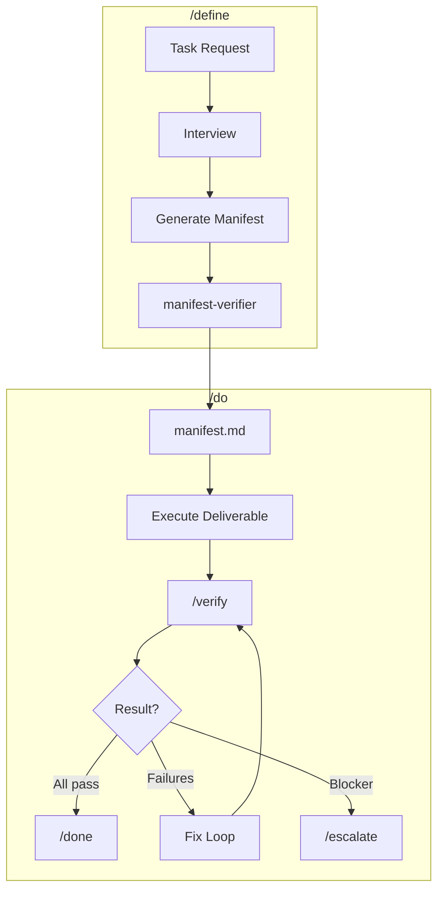

<p align="center">
  <picture>
    
  </picture>
</p>

# Manifest-Driven Development

Define what you'd accept. Verify until it's done.

Stop micromanaging AI implementation. Define acceptance criteria, let the verify-fix loop handle the rest.

## Quick Start

```bash
# Install (run inside Claude Code)
/plugin marketplace add doodledood/manifest-dev
/plugin install manifest-dev@manifest-dev-marketplace

# Use
/define <what you want to build>
/do <manifest-path>
```

**Pro tip**: Run `/do` in a fresh session after `/define` completes—or at minimum, `/compact` before starting. The manifest is your external state; the session doesn't need to remember the conversation.

## Contents

- [The Problem](#the-problem)
- [The Mindset Shift](#the-mindset-shift)
- [How It Works](#how-it-works)
- [What /define Produces](#what-define-produces)
- [Plugin Architecture](#plugin-architecture)
- [The Benefits](#the-benefits)
- [Who This Is For](#who-this-is-for)

## The Problem

You give the agent a task. It generates code. The code looks reasonable. You ship it. Two days later you're debugging something that should have been obvious—or worse, realizing the AI "finished" but left critical pieces incomplete.

This is the vibe coding hangover. We got excited about the speed. We ignored the cleanup cost.

The tools are getting smarter. Claude, GPT, the latest models—they can genuinely code. But we're throwing them into deep water without defining what "done" actually means.

## The Mindset Shift

**Stop thinking about how to make the AI implement correctly. Start defining what would make you accept the output.**

When you ask "how should the LLM do this?", you end up micromanaging the implementation. You write detailed plans. You specify function names and types. You try to puppeteer the AI through every step. The moment something unexpected happens—the plan breaks down. The AI starts using `any` types, adding `// @ts-ignore` comments, bending reality to satisfy the letter of your instructions while violating the spirit.

When you ask "what would make me accept this?", you define success criteria. You specify what the output must do, not how it must be built. You encode your quality standards as verifiable acceptance criteria. Then you let the AI figure out the implementation—and you verify whether it hit the bar.

This is manifest-driven development.

If you know spec-driven development, this is a cousin—adapted for LLM execution. The manifest is a spec, but ephemeral: it drives one task, then the code is the source of truth. No spec maintenance. No drift problem.

## How It Works

Manifest-driven development separates three concerns:

1. **WHAT** needs to be built (deliverables with acceptance criteria)
2. **RULES** that must always be followed (global invariants)
3. **HOW** to verify each criterion (automated checks)

```
/define → Interview → Manifest → /do → Execute → /verify → Fix loop → /done
```

**Define**: An LLM interviews you to surface what you actually want. Not just what you say you want—your latent criteria. The stuff you'd reject in a PR but wouldn't think to specify upfront.

**Do**: The AI implements toward the acceptance criteria. It has flexibility on the how. It doesn't have flexibility on the what.

**Verify**: Automated checks run against every criterion. Failing checks get specific—they say exactly what's wrong.

**Fix**: The AI fixes what failed. Only what failed. It doesn't restart. It doesn't touch passing criteria.

The loop continues until everything passes—or until a blocker requires human intervention.

<details>
<summary><strong>Why This Works (LLM First Principles)</strong></summary>

LLMs aren't general reasoners. They're goal-oriented pattern matchers trained through reinforcement learning. This has implications:

**They're trained on goals, not processes.** RL during training made them fundamentally goal-oriented. Clear acceptance criteria play to their strength. Rigid step-by-step plans fight their nature.

**They can't hold all the nuances.** Neither can you. Some implementation details only surface once you're deep in the code. A rigid plan can't account for unknowns. Acceptance criteria can—because they define the destination, not the path.

**They suffer from context drift.** Long sessions cause "context rot"—the model loses track of earlier instructions. Manifest-driven development compensates with external state (the manifest file) and verification that catches drift before it ships.

**They don't know when they're wrong.** LLMs can't express genuine uncertainty. They'll confidently produce broken code. The verify-fix loop doesn't rely on the AI knowing it failed—it relies on automated checks catching failures.

This isn't a hack around LLM limitations. It's a design that treats those limitations as first principles.

</details>

## What /define Produces

The interview classifies your task (Code, Writing, Document, Blog, Research) and loads task-specific guidance. It probes for latent criteria—things you'd reject in a PR but wouldn't think to specify upfront. A `manifest-verifier` agent validates the manifest for gaps before output.

Here's an example manifest:

````markdown
# Definition: User Authentication

## 1. Intent & Context
- **Goal:** Add password-based authentication to existing Express app
  with JWT sessions. Users can register, log in, and log out.
- **Mental Model:** Auth is a cross-cutting concern. Security invariants
  apply globally; endpoint behavior is per-deliverable.

## 2. Approach
- **Architecture:** Middleware-based auth with JWT stored in httpOnly cookies
- **Execution Order:** D1 (Model) → D2 (Endpoints) → D3 (Protected Routes)
- **Risk Areas:**
  - [R-1] Session fixation if tokens not rotated | Detect: security review
  - [R-2] Timing attacks on password comparison | Detect: constant-time check
- **Trade-offs:**
  - [T-1] Simplicity vs Security → Prefer security (use bcrypt, not md5)

## 3. Global Invariants (The Constitution)
- [INV-G1] Passwords never stored in plaintext
  ```yaml
  verify:
    method: bash
    command: "! grep -r 'password.*=' src/ | grep -v hash | grep -v test"
  ```
- [INV-G2] All auth endpoints rate-limited (max 5 attempts/minute)
  ```yaml
  verify:
    method: subagent
    agent: general-purpose
    prompt: "Verify rate limiting exists on /login and /register endpoints"
  ```
- [INV-G3] JWT secrets from environment, never hardcoded
  ```yaml
  verify:
    method: bash
    command: "grep -r 'process.env.JWT' src/auth/"
  ```

## 4. Process Guidance (Non-Verifiable)
- [PG-1] Follow existing error handling patterns in the codebase
- [PG-2] Use established logging conventions

## 5. Known Assumptions
- [ASM-1] Express.js already configured | Default: true | Impact if wrong: Add setup step
- [ASM-2] PostgreSQL available | Default: true | Impact if wrong: Adjust migration

## 6. Deliverables (The Work)

### Deliverable 1: User Model & Migration
**Acceptance Criteria:**
- [AC-1.1] User model has id, email, hashedPassword, createdAt
  ```yaml
  verify:
    method: codebase
    pattern: "User.*id.*email.*hashedPassword.*createdAt"
  ```
- [AC-1.2] Email has unique constraint
- [AC-1.3] Migration creates users table with indexes

### Deliverable 2: Auth Endpoints
**Acceptance Criteria:**
- [AC-2.1] POST /register creates user, returns 201
- [AC-2.2] POST /login validates credentials, returns JWT
- [AC-2.3] Invalid credentials return 401, not 500
  ```yaml
  verify:
    method: subagent
    agent: code-bugs-reviewer
    prompt: "Check auth routes return 401 for auth failures, not 500"
  ```
````

## The Manifest Schema

| Section | Purpose | ID Scheme |
|---------|---------|-----------|
| **Intent & Context** | Goal and mental model | — |
| **Approach** | Architecture, execution order, risks, trade-offs | `R-{N}`, `T-{N}` |
| **Global Invariants** | Task-level rules (task fails if violated) | `INV-G{N}` |
| **Process Guidance** | Non-verifiable constraints on how to work | `PG-{N}` |
| **Known Assumptions** | Low-impact items with defaults | `ASM-{N}` |
| **Deliverables** | Ordered work items with acceptance criteria | `AC-{D}.{N}` |

Approach section is added for complex tasks with dependencies, risks, or architectural decisions.

## Verification Methods

Every criterion can have an automated verification method:

| Method | When to Use | Example |
|--------|-------------|---------|
| `bash` | Commands with deterministic output | `npm run typecheck && npm run lint` |
| `codebase` | Code pattern checks | Check file exists, pattern matches |
| `subagent` | LLM-as-judge for subjective criteria | Code quality, security review |
| `research` | External information lookup | API compatibility, version checks |
| `manual` | Human verification required | UI review, deployment checks |

```yaml
# Bash verification
verify:
  method: bash
  command: "npm run test -- --coverage"

# Subagent verification with specialized reviewer
verify:
  method: subagent
  agent: code-maintainability-reviewer
  prompt: "Review for DRY violations and coupling issues"

# Manual verification
verify:
  method: manual
  instructions: "Verify the login flow works in staging"
```

## Plugin Architecture

### Core Skills

| Skill | Type | Description |
|-------|------|-------------|
| `/define` | User-invoked | Interview-driven manifest creation. Classifies task type, probes for latent criteria, generates manifest with verification methods. |
| `/do` | User-invoked | Autonomous execution against manifest. Follows execution order, watches for risks, logs progress for disaster recovery. |
| `/verify` | Internal | Spawns parallel verifiers for all criteria. Routes to `criteria-checker` agents based on verification method. |
| `/done` | Internal | Outputs hierarchical completion summary mirroring manifest structure. |
| `/escalate` | Internal | Structured escalation when blockers require human intervention. Requires evidence: 3+ attempted approaches, failure reasons, hypothesis, resolution options. |

### Specialized Review Agents

Built-in agents for quality verification via `subagent` method:

| Agent | Focus |
|-------|-------|
| `criteria-checker` | Core verifier—validates single criterion using bash/codebase/subagent/research methods |
| `manifest-verifier` | Validates manifest completeness during `/define` |
| `code-bugs-reviewer` | Race conditions, data loss, edge cases, logic errors, resource leaks |
| `code-maintainability-reviewer` | DRY violations, coupling, cohesion, dead code, consistency |
| `code-design-reviewer` | Design fitness—reinvented wheels, code vs configuration boundary, under-engineering, interface foresight, PR coherence |
| `code-simplicity-reviewer` | Over-engineering, premature optimization, cognitive complexity |
| `code-testability-reviewer` | Excessive mocking requirements, logic buried in IO, hidden dependencies |
| `code-coverage-reviewer` | Test coverage gaps in changed code |
| `type-safety-reviewer` | TypeScript type safety—`any` abuse, invalid states representable, narrowing issues |
| `docs-reviewer` | Documentation accuracy against code changes |
| `claude-md-adherence-reviewer` | Compliance with CLAUDE.md project rules |

Each reviewer returns structured output with severity levels (Critical, High, Medium, Low) and specific fix guidance.

### Workflow Enforcement Hooks

Hooks enforce workflow integrity—the AI can't skip steps:

| Hook | Event | Purpose |
|------|-------|---------|
| `stop_do_hook` | Stop command | Blocks premature stopping. Can't stop without verification passing or proper escalation. |
| `post_compact_hook` | Session compaction | Restores /do workflow context after compaction. Reminds to re-read manifest and log. |
| `pretool_verify_hook` | `/verify` invocation | Ensures manifest and log are in context before spawning verifiers. |

**Stop hook decision matrix:**
- API error → Allow (system failure)
- No `/do` active → Allow (not in workflow)
- `/do` + `/done` → Allow (verified complete)
- `/do` + `/escalate` → Allow (properly escalated)
- `/do` only → Block (must verify)
- `/do` + `/verify` with failures → Block (fix first)

### Task-Specific Guidance

`/define` loads conditional guidance based on task classification:

| Task Type | Guidance | Quality Gates |
|-----------|----------|---------------|
| **Feature** | `tasks/FEATURE.md` + `CODING.md` | Bug detection, type safety, maintainability, simplicity, test coverage, testability, CLAUDE.md adherence |
| **Bug** | `tasks/BUG.md` + `CODING.md` | Bug fix verification, regression prevention, root cause analysis |
| **Refactor** | `tasks/REFACTOR.md` + `CODING.md` | Behavior preservation, maintainability, simplicity |
| **Prompting** | `tasks/PROMPTING.md` | Prompt quality criteria |
| **Writing** | `tasks/WRITING.md` | Prose quality, AI tells, vocabulary, anti-patterns, craft fundamentals (base for Blog, Document) |
| **Document** | `tasks/DOCUMENT.md` + `WRITING.md` | Structure completeness, consistency |
| **Blog** | `tasks/BLOG.md` + `WRITING.md` | Engagement, SEO |
| **Research** | `tasks/RESEARCH.md` | Evidence-backed research criteria across source rigor, intellectual rigor, AI robustness. Reference material in `tasks/references/research/` |

## Workflow Diagram



**Hooks enforce:** Can't stop without `/verify` passing or `/escalate`. Can't `/escalate` without running `/verify` first.

## The Benefits

**Your first pass lands closer to done.** Verification catches issues before you see them. The fix loop handles cleanup automatically.

**You can trust the output.** Not because the AI is infallible, but because every acceptance criterion has been verified. You know what was checked.

**You can parallelize.** While one manifest is executing, you can define the next. The define phase is where your judgment matters. The do-verify-fix phase runs on its own.

**You stay connected to your codebase.** The define phase forces involvement—you can't write acceptance criteria without understanding what you want. This combats the atrophy problem where heavy AI assistance means losing touch with your own code.

**Your process compounds.** When a PR passes verification but reviewers still find issues, encode those as new review agents or CLAUDE.md guidelines. Next time, the system catches what you missed.

**It's dead simple to use.** Run `/define`, answer the interview questions, run `/do`, go grab coffee. No prompt engineering. No babysitting.

**Resist the urge to intervene.** It won't nail everything on the first pass—that's expected. The verify-fix loop exists precisely for this. You invested in define; now let the loop run. It rarely gets there in a straight line, but it gets there.

## Who This Is For

Experienced developers frustrated by hype-driven AI coding tools. If you're tired of chasing the latest "game-changing" prompt that produces code you spend hours debugging, this offers a grounded alternative.

**Our approach:**
- Workflows designed around how LLMs actually work, not how we wish they worked
- Quality over speed—invest upfront, ship with confidence
- Simple to use, sophisticated under the hood

**Not for:**
- Cost optimizers (workflows may use more tokens for better results)
- Speed-first developers (we prioritize quality over raw speed)
- Hype chasers (we're grounded and realistic)

## Development

```bash
# Setup (first time)
./scripts/setup.sh
source .venv/bin/activate

# Lint, format, typecheck
ruff check --fix claude-plugins/ && black claude-plugins/ && mypy

# Test hooks (run after ANY hook changes)
pytest tests/hooks/ -v

# Test plugin locally
/plugin marketplace add /path/to/manifest-dev
/plugin install manifest-dev@manifest-dev-marketplace
```

## Contributing

See [CONTRIBUTING.md](./CONTRIBUTING.md) for plugin development guidelines.

## License

MIT

---

*Built by developers who understand LLM limitations—and design around them.*

Follow along: [@aviramkofman](https://x.com/aviramkofman)
