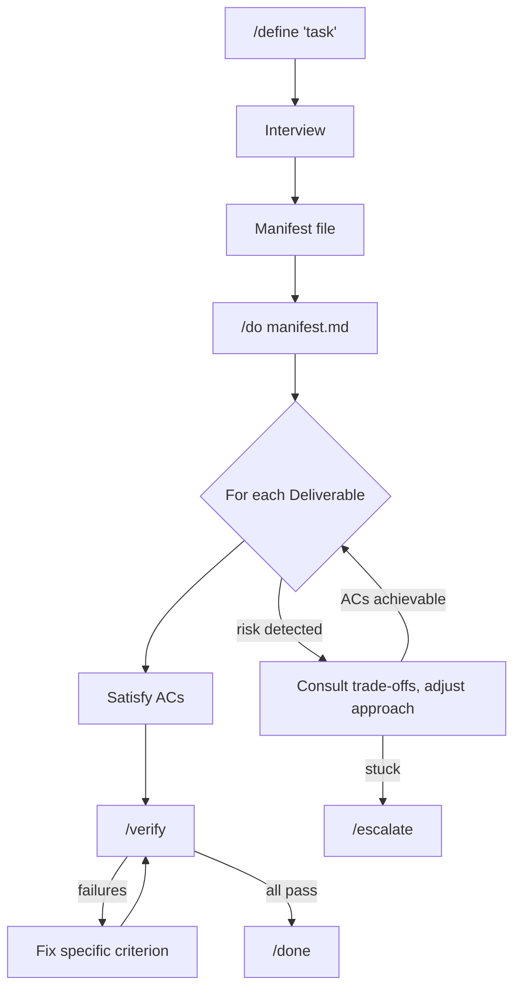

# manifest-dev

Tell Claude what "done" looks like. Let it work. Check the result.

## Quick Start

```
/define "add rate limiting to the API"
/do manifest.md
```

That's it. `/define` interviews you and builds a manifest. `/do` executes it. Two commands.

## The Mindset Shift

Stop thinking about *how* to build it. Start thinking about *what you'd accept*.

"What would make me accept this PR?" "What rules can't be broken?" "How would I know each piece is done?" That's what `/define` asks you. Architecture might come up too, but the pillar is acceptance, not implementation. What does good enough look like?

This works because LLMs are surprisingly good at execution when they know exactly what's expected. They're bad at reading your mind. The manifest closes that gap before a single line of code gets written. Compare that with plan mode, where you're thinking about *how* and still iterating with the model long after implementation starts.

The interview phase is slow. It catches the gaps that blow up after implementation.

## How It Works



---

Everything below is reference. You don't need any of it to get started.

---

## The Manifest

The manifest has three moving parts:

1. **Approach** (complex tasks) -- Validated implementation direction: architecture, execution order, risks, trade-offs
2. **Global Invariants** -- Rules that apply to the ENTIRE task (e.g., "tests must pass")
3. **Deliverables** -- Specific items to complete, each with **Acceptance Criteria**
   - ACs can be positive ("user can log in") or negative ("passwords are hashed")

### Schema

```markdown
# Definition: [Title]

## 1. Intent & Context
- **Goal:** [High-level purpose]
- **Mental Model:** [Key concepts/architecture]

## 2. Approach (Complex Tasks Only)
*Initial direction, not rigid plan. Expect adjustment when reality diverges.*

- **Architecture:** [High-level HOW - starting direction]
- **Execution Order:** D1 → D2 → D3 | Rationale: [why]
- **Risk Areas:**
  - [R-1] [What could go wrong] | Detect: [how you'd know]
- **Trade-offs:**
  - [T-1] [A] vs [B] → Prefer [A] because [reason]

## 3. Global Invariants (The Constitution)
- [INV-G1] Description | Verify: [method]
- [INV-G2] Description | Verify: [method]

## 4. Deliverables (The Work)

### Deliverable 1: [Name]
- **Acceptance Criteria**:
  - [AC-1.1] Description | Verify: [method]
  - [AC-1.2] Description | Verify: [method]
```

### ID Scheme

| Type | Pattern | Purpose | Used By |
|------|---------|---------|---------|
| Global Invariant | INV-G{N} | Task-level rules | /verify (verified) |
| Process Guidance | PG-{N} | Non-verifiable HOW constraints | /do (followed) |
| Risk Area | R-{N} | Pre-mortem flags | /do (watched) |
| Trade-off | T-{N} | Decision criteria for adjustment | /do (consulted) |
| Acceptance Criteria | AC-{D}.{N} | Deliverable completion | /verify (verified) |

## Skills

| Skill | Description |
|-------|-------------|
| `/define` | Interviews you, builds an executable manifest with verification criteria |
| `/do` | Works through the manifest autonomously, verifies everything passes |
| `/verify` | Runs all verifiers in parallel (you rarely call this directly; `/do` handles it) |
| `/done` | Prints what got done and what was verified |
| `/escalate` | When something's blocked, surfaces the issue for you to decide |

### Task-Specific Guidance

`/define` works for any task. Domain-specific guidance loads automatically when relevant:

| Task Type | File | When Loaded |
|-----------|------|-------------|
| Code | `skills/define/tasks/CODING.md` | APIs, features, fixes, refactors, tests |
| Writing | `skills/define/tasks/WRITING.md` | Prose, articles, marketing copy (base for Blog, Document) |
| Document | `skills/define/tasks/DOCUMENT.md` | Specs, proposals, formal docs (+ WRITING.md base) |
| Blog | `skills/define/tasks/BLOG.md` | Blog posts, tutorials (+ WRITING.md base) |
| Research | `skills/define/tasks/research/RESEARCH.md` + source files | Research, analysis, investigation. Source-specific guidance in `tasks/research/sources/` |
| Other | (none) | Doesn't fit above categories |

The universal flow works without any task file. Task files contain condensed domain knowledge that `/define` uses during probing. Full reference material for `/verify` agents lives in `skills/define/tasks/references/`.

## How the Interview Works

`/define` doesn't ask you to brainstorm from scratch. It proposes things, you react. It already knows a lot about common task shapes, so it generates candidates and you correct, approve, or reject them. Faster than staring at a blank prompt.

It walks through these in order, starting with whatever gives the most signal:

1. Intent & Context (what kind of task, how big, what could go wrong)
2. Deliverables (what are we building?)
3. Acceptance Criteria (how do we know each piece is done?)
4. Approach (for complex tasks: architecture, execution order, risks, trade-offs)
5. Global Invariants & Process Guidance (rules that apply everywhere, detected automatically)

## Agents

### Core Workflow

| Agent | Purpose |
|-------|---------|
| `criteria-checker` | Read-only verification agent. Validates a single criterion using commands, codebase analysis, file inspection, reasoning, or web research. Returns structured PASS/FAIL. |
| `manifest-verifier` | Reviews /define manifests for gaps and outputs actionable continuation steps. Returns specific questions to ask and areas to probe. |

### Code Reviewers

These run in parallel during `/verify`:

| Agent | Focus |
|-------|-------|
| `code-bugs-reviewer` | Audits code changes for logical bugs without making modifications |
| `code-coverage-reviewer` | Verifies code changes have adequate test coverage, reports gaps |
| `code-maintainability-reviewer` | DRY violations, coupling, cohesion, consistency, dead code, architectural boundaries |
| `code-design-reviewer` | Design fitness: reinvented wheels, code vs configuration boundary, under-engineering, interface foresight |
| `code-simplicity-reviewer` | Unnecessary complexity, over-engineering, cognitive burden |
| `code-testability-reviewer` | Code that requires excessive mocking, business logic hard to verify in isolation |
| `type-safety-reviewer` | TypeScript type holes, opportunities to make invalid states unrepresentable |
| `claude-md-adherence-reviewer` | Verifies code changes comply with CLAUDE.md instructions and project standards |
| `docs-reviewer` | Audits documentation accuracy against recent code changes |

## Hooks

Three hooks keep the workflow honest. `stop_do_hook.py` won't let you stop before verification runs. `post_compact_hook.py` restores `/do` context if the session gets compacted. And `pretool_verify_hook.py` nudges agents to actually read the manifest before verifying anything.
